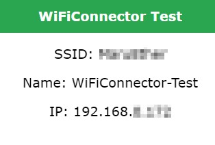
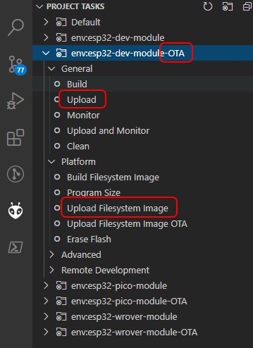

# stevesch-WiFiConnector

Provides simplified WiFi Manager and over-the-air update setup (sketch basically just needs to call setup and loop for the library).

examples/minimal provides a simple sketch that loops and outputs status (current SSID, IP, etc.) on the serial port.

# Building and Running

To get up-and-running:
- PlatformIO is recommended
- Build this library (builds its own minimal example)
- Upload to any ESP32 board via USB
- When your board is booted, a WiFi config portal named "WiFiConnector-Test" should be available.
- Connecting to the "WiFiConnector-Test" WiFi network with any device and set the config options for the WiFi network of your router (choose your network/SSID and set the password).
- Connect to your router's WiFi network and open the ESP32 page in any browser.  The IP of the device will be displayed in the serial output if you're monitoring serial output of the board.  If your router supports mDNS, you should be able to open

"http://WiFiConnector-Test.local/"

(otherwise you'll need to open, e.g.

"http://192.168.x.x" or "http://10.x.x.x"

where x.x/x.x.x matches the address displayed in the serial output from your board).

The following page should be displayed:

Building from this example, you can replace the HTML with your own page and page handling code.

## Over-the-air updating

Once you are able to properly connect and view your web page, over-the-air updates can be performed using the platforio build configurations ending in "-OTA" (these are preconfigured to use the host name and optional password of "0000" specified in the platformio.ini file).
Choose "Upload" to upload code changes, and "Upload Filesystem Image" to upload files in your data folder to the SPIFFS file system (if you have added such files to the sketch).

